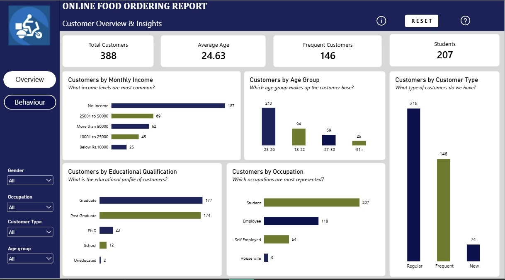
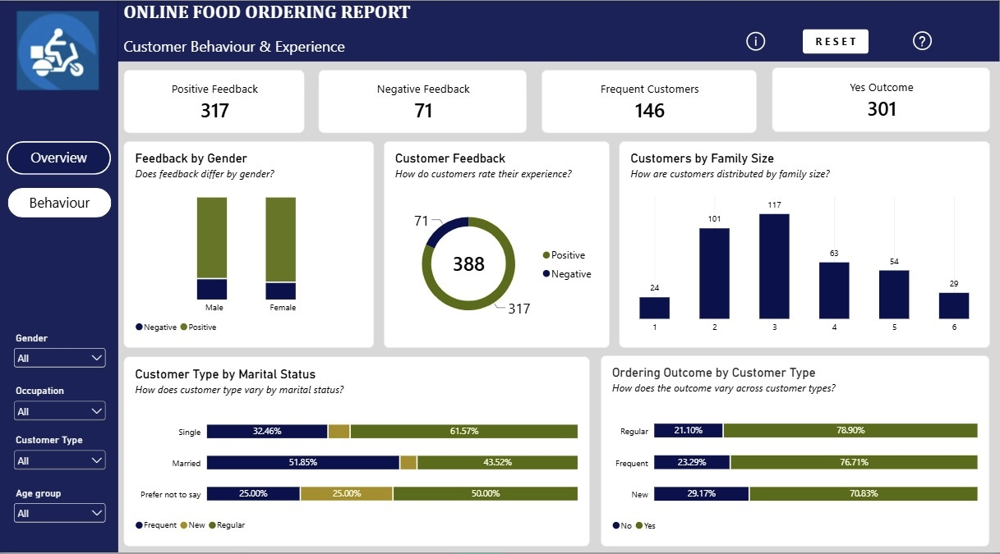

🍔 Online Food Ordering Report

Customer Analysis, Behavior & Feedback Insights Using Power BI

🔗 Project Overview

The Online Food Ordering Report is an interactive Power BI project focused on understanding customer demographics, customer types, and feedback patterns within an online food ordering dataset.

The project analyzes 388 customer records across 13 columns to explore customer characteristics, ordering behavior, and customer experience.

The report consists of two interactive dashboard pages: Customer Overview and Customer Behavior & Experience. Together, they provide a clearer view of the customer base and highlight patterns that can support customer experience analysis and business decision-making.

🔗 Business Problem

Understanding customers is important for businesses that want to improve customer experience, engagement, and retention.

Customer data can reveal useful patterns in demographics, customer types, and feedback. However, these patterns need to be organized and presented clearly to support meaningful analysis.

This project uses Power BI to transform an online food ordering dataset into interactive dashboards that make customer characteristics and feedback patterns easier to explore.

The analysis focuses on:

* Customer demographics and characteristics
* Customer types and ordering behavior
* Customer feedback and experience
* Differences in feedback across customer groups
* Customer distribution by family size, education, income, and occupation

🔗 Key Business Questions

The analysis was designed to explore the following questions:

* How many customers are represented in the dataset?
* What is the average age of the customers?
* How many customers are classified as frequent customers?
* How many customers are students?
* How are customers distributed across age groups, income levels, and occupations?
* How do customer types differ within the dataset?
* What is the overall distribution of positive and negative feedback?
* How does feedback vary by gender?
* How does customer output differ by customer type?
* How are customers distributed across different family sizes?
* What insights can customer demographics and feedback provide about the customer experience?

🔗 Dataset Overview

The project uses the Online Food Ordering Report dataset.

🔗 Dataset Details

* Total Records: 388 rows
* Total Columns: 13
* Data Structure: Single table
* Data Source: Online Food Ordering Report dataset

The dataset contains customer demographic information, customer classifications, and feedback-related fields.

🔗 Key Dataset Fields

The dataset includes fields such as:

* Age
* Customer Type
* Education
* Family Size
* Feedback
* Gender
* Income
* Occupation
* Output

These fields support the analysis of customer characteristics, customer groups, and feedback patterns.

🔗 Data Preparation & Transformation

Data preparation was carried out in Power Query before creating the dashboard.

🔗 Data Cleaning

The following steps were performed in Power Query:

* Removed duplicate records
* Identified and addressed data inconsistencies
* Changed data types to ensure fields were suitable for analysis

🔗 Data Transformation

Calculated columns were created where needed to support customer classification, analysis, and dashboard visualizations.

After preparation, the dataset was loaded into Power BI for analysis and visualization.

🔗 Data Modeling

This project uses a single-table dataset, so relationships between multiple tables were not required.

The analysis was performed directly on the prepared table, with calculated columns and measures used where needed to support the dashboard.

🔗 Key Metrics

The dashboards present the following key metrics:

* Total Customers: 388
* Average Age: 24.63 years
* Frequent Customers: 146
* Students: 207
* Positive Feedback: 317
* Negative Feedback: 71

Positive feedback accounts for approximately 81.7% of the feedback records, while negative feedback represents approximately 18.3%.

This indicates that positive feedback was substantially more common than negative feedback in the dataset.

🔗 Power BI Dashboard Structure

The report contains two interactive dashboard pages, each focusing on a different aspect of customer analysis.

🔗 Page 1 — Customer Overview

Purpose: Explore customer demographics, characteristics, and customer types to understand the composition of the customer base.

🔗 Key Insights

* The dataset contains 388 customers, with an average age of 24.63 years.
* 207 customers are identified as students, making students a significant group within the dataset.
* 146 customers are classified as frequent customers.
* Customer distribution can be explored across income, education, age, occupation, and customer type.
* These demographic breakdowns provide a basis for understanding the composition of the customer base and identifying customer groups for further analysis.

🔗 Page 2 — Customer Behavior & Experience

Purpose: Examine customer feedback and behavior patterns to better understand customer experience across different groups.

🔗 Key Insights

* 317 customers provided positive feedback, compared with 71 customers who provided negative feedback.
* Positive feedback represents approximately 81.7% of the feedback records, while negative feedback represents approximately 18.3%.
* Feedback can be compared by gender to explore differences in customer experience across groups.
* The Output by Customer Type visual helps examine how output is distributed across customer classifications.
* The family-size analysis shows how customers are distributed across different household sizes.
* Although positive feedback is more common, the negative feedback responses provide an opportunity to investigate areas where the customer experience may need improvement.

🔗 Key Findings

🔗 1. Positive Feedback Dominates the Dataset

Of the 388 records, 317 were associated with positive feedback and 71 with negative feedback. This suggests that positive experiences were more frequently reported in the dataset, although the negative responses still warrant attention.

🔗 2. Students Represent a Substantial Customer Group

The dataset includes 207 students. Understanding their preferences and feedback may help businesses better evaluate the needs and experiences of this customer group.

🔗 3. A Considerable Number of Customers Are Frequent Customers

A total of 146 customers are classified as frequent customers. This group may offer useful opportunities for further analysis of customer satisfaction, engagement, and retention.

🔗 4. Customer Demographics Provide Useful Segmentation Opportunities

The availability of age, income, education, occupation, gender, and family-size fields allows the customer base to be explored from multiple perspectives.

🔗 5. Feedback Analysis Can Support Customer Experience Improvements

Comparing feedback across gender and customer types provides a starting point for investigating whether customer experiences differ across groups.

🔗 Recommendations

Based on the analysis, the following actions could support a better understanding of customers and their experiences:

* Investigate negative feedback: Review the 71 negative feedback records to identify recurring complaints and potential areas for improvement.
* Understand student customers: Explore the preferences and feedback of student customers to better understand their needs.
* Encourage customer retention: Investigate the characteristics and feedback patterns of frequent customers to identify factors associated with repeat engagement.
* Explore customer segments: Use demographic fields to compare customer groups and identify meaningful differences in feedback or behavior.
* Monitor customer feedback: Track positive and negative feedback over time as more data becomes available.
* Use findings to guide decisions: Combine customer feedback with further operational data, where available, to investigate possible reasons behind customer experiences.

🔗 Technologies Used

* Power BI — Dashboard development and data visualization
* Power Query — Data cleaning and transformation
* DAX — Measures and analytical calculations

🔗 Project File

The complete Power BI project file is available in the GitHub repository.

Project file: Online Food Ordering Report.pbix

Replace the filename above with the exact PBIX filename and add its relative link if you upload it to the repository.

🔗 Conclusion

The Online Food Ordering Report demonstrates how customer data can be prepared, analyzed, and presented through interactive Power BI dashboards.

The project explores customer demographics, customer classifications, and feedback patterns, highlighting the prevalence of positive feedback and the importance of understanding different customer groups.

By combining customer overview metrics with behavioral and feedback analysis, the report provides a foundation for further investigation into customer experience, engagement, and retention.

🔗 Author

John Ubi

Data Analyst | Power BI | SQL | Power Query

🔗 Connect With Me

LinkedIn: https://www.linkedin.com/in/john-ubi-858911292
Email: ubijohn001@gmail.com

